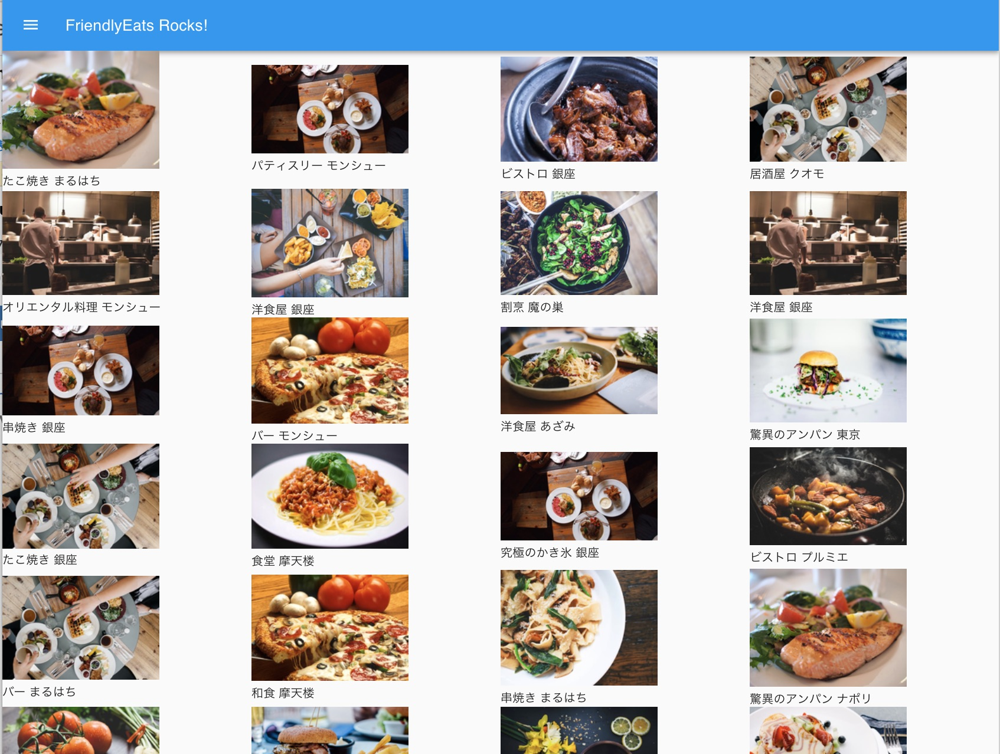

## Yet another FriendlyEats

This is yet another FriendlyEats based on [a start-up kit for a Firebase web project, which uses React](https://github.com/hideya/firebase-startup-kit).

[Firebase スタートアップキット React版](https://github.com/hideya/firebase-startup-kit) をベースにした「FriendlyEats」ウェブアプリ作成チュートリアルです。

## Usege

See [tutorial document](https://isamu.github.io/FriendlyEats-React/) (All in Japanese) 
くわしくは、[チュートリアル](https://isamu.github.io/FriendlyEats-React/) をご覧ください。
